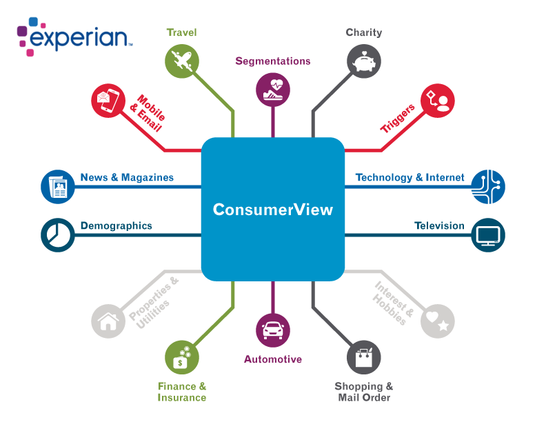
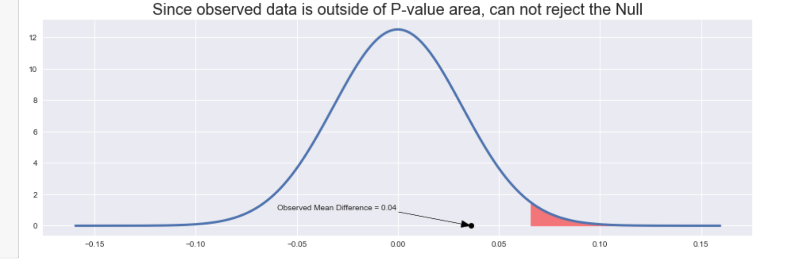
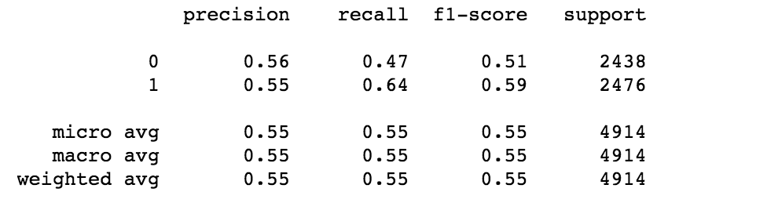

# Customer Churn Prediction using Experian Data
### Kane Ren

# Table of contents
Background and the Data

### Background and the Data

Business can purchase data from Experian to get more insight about their customers.
 
By sending customer information to Experian and pay a fee. It will return back data of the customer in many area, such as their hobby, interest, etc.

My final data contain customers' subscription status and the customer's data from Experian.
 
Subscription Status is base on after a free trial subscription.
 
Active: users continue to subscribe after trial. 
Cancel/Expire: users op out of the subscription after trial.
### Goal
Create model to Predict Customer Churn by using the Experian Data.

Model include Logistic, Random Forest, Gradient Boost, Neural Network.

Baseline probability 0.5, Model should do better than random Guess

## Data and Cleaning
- The Data contain 20000 rows and 492 Columns.
- a heatmap of missing data is shown below:

Some column has no data at all, which will be remove

For most of other missing data, when data is missing, the whole row is missing as well, so all those rows will be dropped because a whole row of missing value doesn't contribute anything to my analysis.

### Exploratory Data Analysis(EDA)
I will be plotting the distribution of both active group and cancel group on the same graph to see the the difference between the two.

By looking at the plot below, a better idea how the distribution for one column of numerical data looks like for each of the group. It will provide information on what the is the shape, where the mean it is, and a general idea of the difference.

For the "wine lovers" column, both group has a positive skew distribution, with mode around 10, and the mean is 34.1y for the active user group, 39.44 for the cancel group.

Another two example: column "video gamer" and "dog owner".

From the above two plot, both group actually has similar shape of distribution. 
However, for "video gamer" column, the mean is far more apart then the "dog owners" column.

### Correlation between numerical variable.
Since we are at the exploring data process, we want to see if there is any correlation between the datas. To do so, I decide to create a correlation heat map to identify these relationship.

Looking at the correlation heatmap above, we can definitely see some variable with strong correlation.

For example, the "medical policy" and "life insurance policy" has a correlation of 0.91. Its scatter plot shown below:

From the above scatterplot, we can see a strong pattern. As one variable increase, the other tend to increase as well.
 
This make sense, since both medical and life insurance usually come together.

So one of the column of medical policy or life ins policy will be dropped, I dropped the life ins column in this case.

We can use the same technique to examine other pairs with high correlation as well. This might reduce the effect of collinearity for a better model fit in the future.

## Hypothesis Testing

Since the goal is to find out if there is really a difference between the score of Active group and Cancel group. I will be doing a  significance test on the difference of mean value. I will perform the test on two column here, but it can apply to all. Since the sample size is really large in this data,8700 for the active group and 8596 for the cancel group. I will use z-test instead of t-test since there will be nearly no difference in the result.

The alpha for the z-test will be 0.02.

The two column to perform the test below will be the "wine lover" and "dog owners" columns

For "wine lover" column, looking at the shape of distribution,a highly positive skew is observed, I will perform a square root transformation on the data, the result will display below. 

Before:

After:

The shape of the data really close to symmetric after the transformation, so we can approximate the data with a normal distribution.

Using the z-test to see if mean score of wine lover score differ between the Active and Cancel group yields:

Result of z = -12.196, p-value = 0.0000

- Conclusion, at alpha=0.02, a p-value of 0.0000 means we reject the null hypothesis test, it's really likely there is a difference between the mean wine lover score between the active group and cancel group.

Apply the same treatment for the dog owner column.
 
Since the distribution of the data is already symmetric, transformation of data is not needed.

For the dog owner column, we get a result of z = 1.132, p-value = 0.1288.

- At alpha=0.02, a p-value of 0.1288 means we fail to reject the null hypothesis test, we can't say there is a difference between the mean dog owner score between the active and cancel group.

### Confidence interval
In the above significance test, we conclude there is a high possibility of difference in mean wine lover score between the two group.  

But most of the time it is better to provide a confidence interval, the confidence interval provide more context on how much actually the difference is.

Creating a 95% Confidence Interval for the "wine lover" column yields: (-0.5099, -0.3687)

Since this is a square root of the data, the range will be from 1 to 10 (Original numerical column is 1 to 99)

Interpretation of this confidence interval:
- At a scale of 10, we are 95% confidence that the true mean difference of wine lover value between the active group and cancel group is between (-0.5099, -0.3687). In context, the lower the value, the more likely the person is a "Wine Lover", so the active group is more likely to be a wine person.

## Building A Model
A distribution of every column compare the two group of users is created. By looking at the distribution of each column, there is actually no huge disinclination on the two group of user.

Because of that, first to just build a Simple Logistic Model with all features, see how it looks

The number Active user and Inactive User is really even in the data. There is 8244 active user and 8134 inactive users.

If every user is guess as Active, the accuracy will be 8244/(8244+8134) = 0.5033, which is about 50%. Our model should do better than that

For a simple Logistic Model base on all Features:

The accuracy is about 0.57.

The ROC Curve

The accuracy and ROC curve both not good, but that is expected since as mention above, for this data set, the distribution of two group of user are pretty much on top of each other.

Create a basic Random Forest Model and Gradient Boost Model:

Random Forest:

Gradient Boost:

Both model perform really similar to the Logistic Model, just higher recall in predicting active user.

Since all model is a bit weak, try to just use feature that has the most difference.

By using the best 10 Features and build a Logistic Model:

The result is also really similar.

Using RFE from Sklearn to pick 1 of the best feature from the 10 features:

The model with 1 feature has a accuracy decrease in 2%

After Many Trial and Errors, using GridSearch From Sklearn, the best performing model is Gradient Boost by using all features with specific parameter:

With this model, accuracy can go up to 58%, a 1% increase from the original model.

### Conclusion
Because the distribution of feature for Active user and Inactive user is not really distinguishable, the model doesn't perform really well.

A Neural Network can also be seen in the source code, the performance is not good either.

A final Accuracy of 58% is slightly better than random guessing. Depends on the business situation, that could mean a lot or nothing.

To Identify Customer that Churn, a Log Model on all feature is the best, with 0.57 precision and recall. To Identify Customer that didn't Churn, a Gradient boost model is best with 0.58 precision and 0.65 recall.
